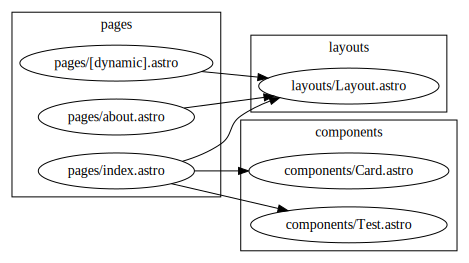

# View Astro project dependencies

This script generates a (very basic) graph of the dependencies in an astro project.

```
my-astro-project % ../astro-dependencies/astro-deps.js -h
Usage: dependencies [options]

Generate a graph of the dependencies between astro files in a project.

Options:
    -c, --clusters  Use clusters in the output graph
    -o, --outpath   Output directory for the generated files
    -h, --help      Show this help message
```

## Example

```
astro-demo % ../astro-dependencies/dependencies.js -c                                                             [main L|…3]
File created at ./dependencies.json (327 bytes)
File created at ./dependencies.dot (628 bytes)
File created at ./dependencies.svg (5479 bytes)
```


